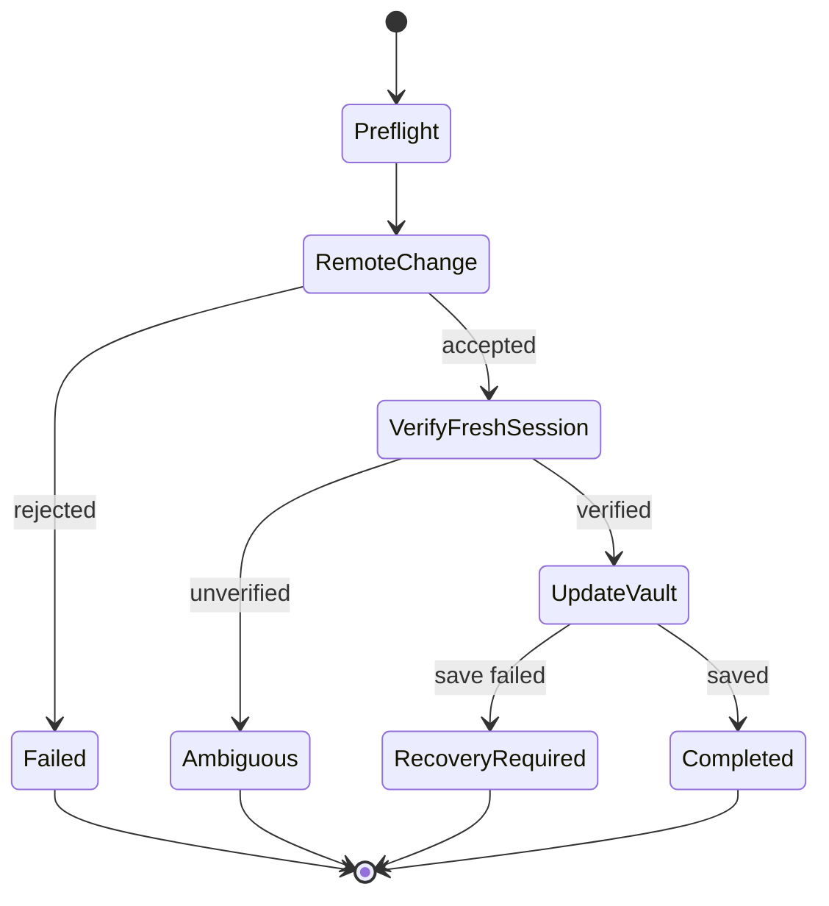

# Architecture

## Components

### Local control plane

The control plane owns policies, schedules, approvals, transaction state, and the audit trail. It must not possess long-lived decrypted credentials.

### Vault adapters

Adapters expose a minimal contract:

```text
connect
unlock
listEntries
getCredential
updateCredential
lock
```

Vaultwarden/Bitwarden is the first planned real adapter. Other vaults must be addable without changing the rotation engine.

### Browser runner

The runner receives one template, one credential, and one generated replacement. Each execution uses an isolated browser context and an origin allowlist. The runner returns structured evidence instead of arbitrary output.

### Template registry

The public registry contains only signed templates, metadata, tests, revocations, and compatibility information. Clients pull registry metadata. The registry never connects to local installations.

### Local template workshop

The workshop creates declarative recipes, validates them, signs their manifests with the local Ed25519 identity, and persists them as private files. Imported bundles must match an expected SHA-256 and a pre-approved signer. The private signing key is encrypted at rest; OS keychain integration is still pending.

## Rotation transaction



The remote website is authoritative once it accepts the new password. Failure to update the vault after that point creates a recovery incident, not an ordinary retry.

## Deployment model

The UI and control plane are local. A future headless deployment may run the controller on a home server and connect to explicit browser runners on user devices. Local-only all-in-one mode remains the initial target.
